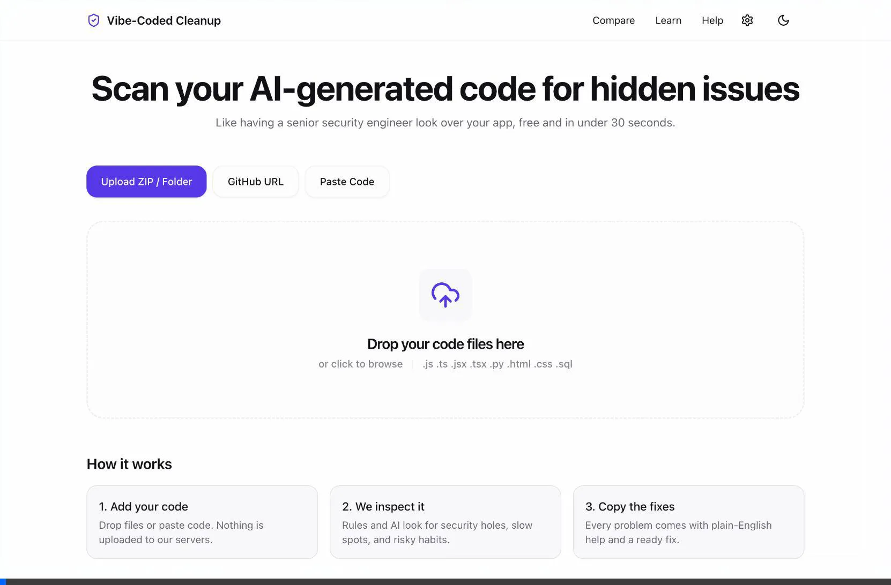

# Vibe-Coded Cleanup

**AI-powered code review and security analysis for apps built with AI coding assistants.**

Vibe-Coded Cleanup helps non-technical creators and AI-assisted developers identify hidden security vulnerabilities, exposed secrets, inefficient database queries, and other issues commonly introduced by AI-generated code.

Instead of overwhelming you with technical jargon, it explains each issue in plain English, shows why it matters, and provides safe, copy-paste fixes — so you can understand, improve, and confidently ship your application.

## Overview

Vibe-Coded Cleanup is a fast, offline-capable code review tool focusing heavily on privacy and accessibility for non-technical users. It employs an excellent client-side architecture (PWA, virtualized lists, edge/client static analysis) and seamlessly layers on AI when deeper semantic understanding is needed.



AI coding assistants such as ChatGPT, Claude, and Cursor make it easier than ever to build complete applications without being an experienced software engineer.

However, generated code can also introduce problems that are difficult to spot:

* Exposed API keys and secrets
* Insecure configurations
* Potential security vulnerabilities
* Inefficient database queries
* Problematic coding patterns
* Performance issues
* Other common AI-generated code mistakes

**Vibe-Coded Cleanup** acts as a second pair of eyes for your project, combining deterministic code analysis with AI-powered semantic review.

---

## Features

### Browser-Based & GitHub Integration

No installation or complex setup is required. You can drag and drop your project directly from your browser, or **scan any public GitHub repository instantly via URL**.

### Free to Use

The application is designed around free-tier infrastructure, including Groq's API, with user data and scan history stored locally on the user's device.

### Plain-English Explanations

Every detected issue is explained without unnecessary technical jargon and, where useful, includes a real-world analogy to make the underlying concept easier to understand.

### Automated Fixes

Get corrected code directly from the interface, or generate a patched ZIP containing the suggested fixes.

### Architecture & Complexity Visualizations

Vibe-Coded Cleanup automatically maps your project's architecture, rendering an interactive dependency graph (Mermaid), a security severity Heatmap, and an AST-complexity Treemap so you can see exactly where technical debt is accumulating.

### Scan Comparison & Team Collaboration

Compare previous scans to track improvements over time and monitor changes to your project's overall Health Score. 
Share annotated views with your team using URL `#hash` links that require zero backend databases.

### Built-in Learning Center

Learn the fundamentals behind common security and code-quality issues through short, interactive lessons.

### Offline Support

Install Vibe-Coded Cleanup as a Progressive Web App (PWA) and run supported rule-based checks even when you are offline.

---

## How It Works

1. Open **[Vibe-Coded Cleanup](https://vibe-coded-cleanup.vercel.app)**.
2. Drag and drop your project folder, upload a ZIP file, or provide a **GitHub URL**.
3. Let the analysis engine scan your codebase.
4. Review detected issues, architectural diagrams, and complexity treemaps.
5. Apply individual fixes or use **Fix All**.
6. Annotate and share the report with your team, or download a patched version of your project.
7. Compare future scans to track your progress.

---

## Architecture

Vibe-Coded Cleanup is designed around three core principles:

**Speed · Privacy · Simplicity**

### Two-Layer Analysis Engine

The analysis pipeline combines deterministic static analysis with AI-powered semantic analysis.

#### 1. Rule-Based Analysis

Runs locally and at the edge using deterministic rules located in `lib/analyzers/`.

It uses techniques such as:

* Regular-expression analysis
* AST-based analysis
* Indentation and structural parsing
* Security-focused pattern detection

These checks are extremely fast and can operate without an internet connection.

#### 2. Semantic AI Analysis

More complex issues are analyzed using Llama through the Groq API.

The `/api/analyze` endpoint processes code in optimized chunks to handle larger projects while remaining compatible with free-tier API limitations.

---

## Privacy & Data Architecture

Privacy is a core part of the architecture.

### No Database for User Code

Project source code is **not stored in a database**.

Uploaded code is processed in memory by the application's server-side/edge processing layer and is discarded after processing.

### Local-First Storage

User-specific information such as:

* Scan history
* Preferences
* API keys
* Application state

is stored locally using browser storage such as:

* `localStorage`
* `IndexedDB`

This allows the application to maintain useful history without requiring a centralized database for user projects.

### What Leaves Your Machine?

Vibe-Coded Cleanup is built with privacy in mind. Here is exactly what data is transferred or saved:

* **Source Code**: If using rule-based local scanning, your code **never leaves your browser**. If using the AI analysis, the selected code snippets are sent directly to the Groq API (api.groq.com).
* **GitHub Repositories**: When providing a GitHub URL, file contents are fetched directly from GitHub's servers (`api.github.com` and `raw.githubusercontent.com`).
* **Local Storage**: Your scan history, preferences, and API keys are stored in your browser's local storage and IndexedDB.
* **Output Artifacts**: You can explicitly download HTML, JSON, and Markdown reports, or a ZIP file of the automatically patched source files. These are generated locally.

---

## Progressive Web App

Vibe-Coded Cleanup is built as a Progressive Web App.

The application includes:

* Service Worker support
* Aggressive asset caching
* Offline support for supported rule-based scans
* Native installation support for desktop and mobile
* PWA manifest and application metadata

Users can install the application directly from their browser and use it similarly to a native application.

---

## Performance

Large scan results can contain thousands of detected issues.

To maintain smooth rendering and scrolling, Vibe-Coded Cleanup uses `@tanstack/react-virtual` to virtualize large lists and minimize unnecessary DOM rendering.

The result is a responsive interface even when processing large AI-generated outputs.

### Analysis Benchmark

The local rule-based analysis is exceptionally fast. Running over a **147 KB (~7000 lines)** code payload on a standard machine yields:

| Analyzer             | Execution Time |
|----------------------|----------------|
| **Regex Analyzer**   | ~7.10 ms       |
| **AST Analyzer**     | ~35.97 ms      |
| **Dependency Checks**| ~0.14 ms       |

---

## Tech Stack

| Category         | Technology                |
| ---------------- | ------------------------- |
| Framework        | Next.js 14 — App Router   |
| Language         | TypeScript                |
| Styling          | Tailwind CSS              |
| Icons            | Lucide React              |
| State Management | Zustand                   |
| AI               | Groq API                  |
| AI Model         | Llama                     |
| Virtualization   | `@tanstack/react-virtual` |
| Unit Testing     | Vitest                    |
| E2E Testing      | Playwright                |
| Deployment       | Vercel                    |
| Storage          | localStorage / IndexedDB  |
| Application Type | Progressive Web App       |

---

## Project Structure

```text
vcc/
├── app/                         # Next.js App Router
│   ├── api/                     # Serverless API routes
│   ├── compare/                 # Historical scan comparison
│   ├── learn/                   # Learning center
│   └── scan/                    # Scan results
│
├── components/                  # React components
│   ├── common/                  # Shared UI components
│   ├── results/                 # Issue cards and result views
│   ├── scanner/                 # Upload and code scanning UI
│   └── ui/                      # Base design system
│
├── lib/                         # Core application logic
│   ├── analyzers/               # Static analysis rules
│   ├── llm/                     # Groq client and AI processing
│   └── reporters/               # Markdown and HTML exporters
│
├── tests/                       # Unit and E2E tests
│
└── public/                      # Static assets and PWA files
```

---

## Getting Started

### Prerequisites

* Node.js
* npm
* A Groq API key if you want to use your own API credentials

### Installation

Clone the repository:

```bash
git clone https://github.com/your-username/vibe-coded-cleanup.git
cd vibe-coded-cleanup
```

Install dependencies:

```bash
npm install
```

### Environment Variables

Create a `.env.local` file:

```env
GROQ_API_KEY=your_key
```

The API key is optional depending on how you configure the application.

### Run the Development Server

```bash
npm run dev
```

Then open:

```text
http://localhost:3000
```

---

## Testing

Run unit tests with:

```bash
npm run test
```

Run end-to-end tests with:

```bash
npm run test:e2e
```

---

## Contributing

Contributions are welcome.

You can help improve Vibe-Coded Cleanup by:

* Adding new security rules
* Improving existing analyzers
* Adding language-specific checks
* Improving AI analysis prompts
* Improving the learning content
* Adding test coverage
* Improving performance
* Fixing bugs

Please read [`CONTRIBUTING.md`](./CONTRIBUTING.md) before submitting a contribution.

---

## License

Vibe-Coded Cleanup is released under the **MIT License**.

See [`LICENSE`](./LICENSE) for the full license text.

---

## Why Vibe-Coded Cleanup?

AI has made software development dramatically more accessible.

But **being able to generate code isn't the same as knowing whether that code is safe, efficient, or production-ready.**

Vibe-Coded Cleanup bridges that gap by turning complex code-review concepts into actionable feedback that anyone can understand.

**Build with AI. Review with confidence. Ship responsibly.**
